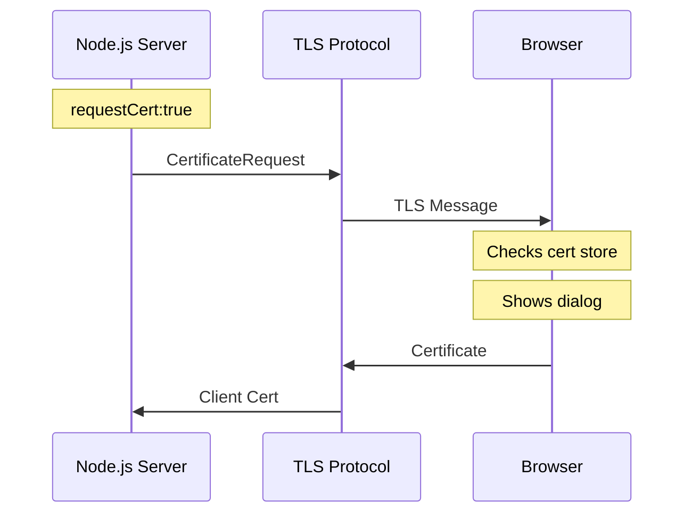
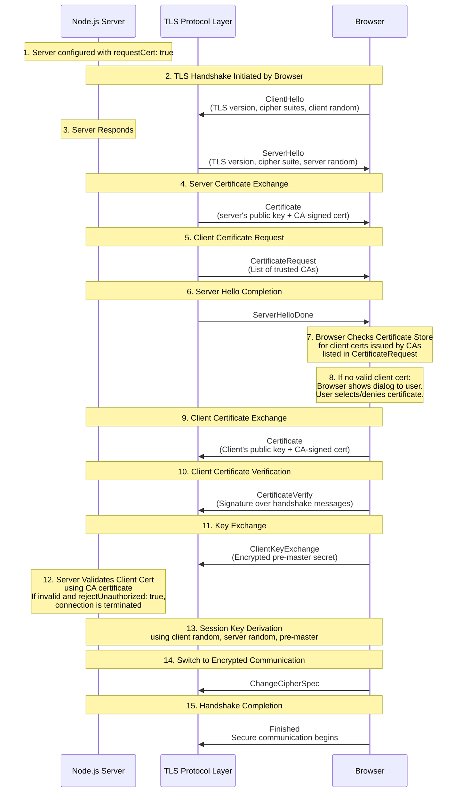
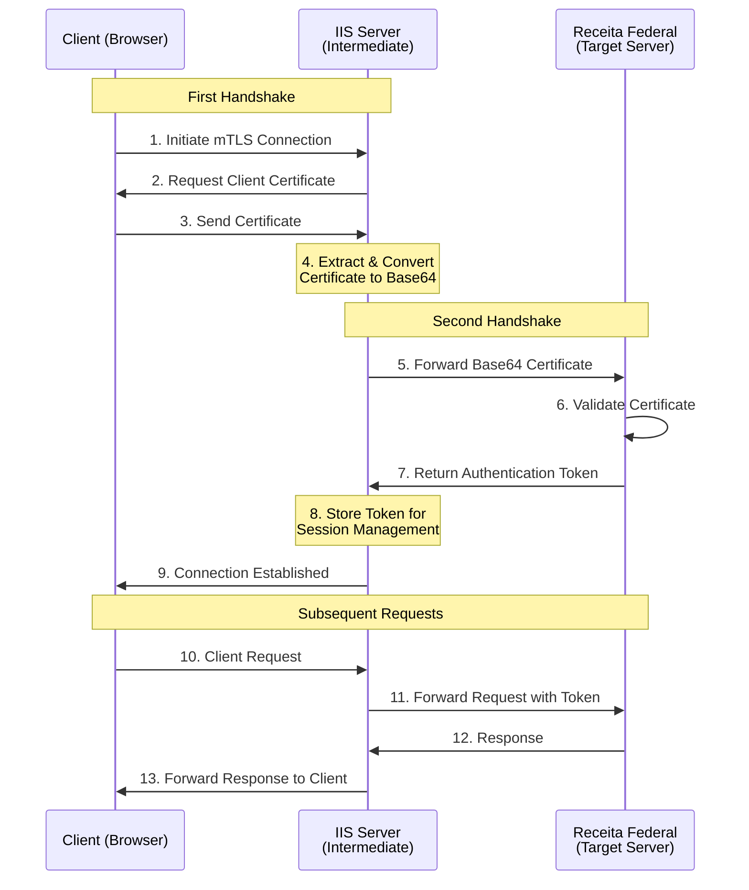

# Conversor de Certificado Digital para Base64

Esta é uma aplicação simples de prova de conceito (PoC) que converte um certificado digital em uma string base64 e a envia para um servidor.

## Descrição

Esta aplicação demonstra o processo de obtenção de um certificado de cliente durante um handshake mTLS (mutual TLS). Quando um cliente se conecta, o servidor inicia uma renegociação TLS [[4]] para solicitar o certificado do cliente. Assim que a conexão segura é estabelecida, o servidor extrai o certificado, o converte para o formato base64 e o envia de volta ao cliente. Esse processo permite a autenticação e identificação segura de clientes que se conectam ao servidor.

## Requisitos

- Node.js (versão 23.6.0 ou superior)
- npm (versão 11.0.0 ou superior)
- Python (versão 3.10.12 ou superior)

## Instalação

1. Clone o repositório: `git clone https://github.com/carloshnp/digital-certificate-base64-poc.git`
2. Navegue para o diretório do projeto: `cd digital-certificate-base64-poc`
3. Instale as dependências: `npm install`
4. Instale o cliente e o servidor: `npm run install:all`

## Uso

1. Gerar certificados no diretório do servidor: `cd server && python3 generate_certificate.py` 
2. Executar o servidor e o cliente em paralelo: `cd .. && npm run dev`
3. Abrir o cliente no Chrome: `http://localhost:5173`

## Introdução

O handshake mTLS (mutual TLS) nesta implementação envolve uma autenticação bidirecional complexa entre o servidor e o browser. Ao contrário do TLS padrão, o mTLS requer que ambas as partes apresentem e validem certificados. Usando o `TLSSocket` do Node.js [[5]], o fluxo de handshake é:

### Fluxo do handshake mTLS



1. **Server-side (Node.js/OpenSSL)**:
- Utiliza OpenSSL para a implementação do TLS
- Envia uma solicitação de certificado durante a renegociação TLS
- Valida os certificados recebidos

2. **Browser-side (Chrome/BoringSSL)**:
- Usa o BoringSSL (*fork* do OpenSSL do Chrome)
- Verifica o armazenamento de certificados do sistema operacional
- Mostra um dialogo para selecionar o certificado

3. **Sistema Operacional**:
- Gerencia armazenamentos de certificados
- Fornece uma interface nativa para o usuário selecionar o certificado
- Valida os certificados

O processo inteiro é tratado no nível de protocolo TLS, implementado através de:
- Server: OpenSSL (via Node.js)
- Browser: BoringSSL (Chrome)
- OS: APIs de gerenciamento de certificados nativas

## Protocolos SSL/TLS e SNI [[1]] [[2]]

### Visão geral do SSL e TLS

O SSL (Secure Sockets Layer) e TLS (Transport Layer Security) são protocolos criptograficos desenvolvidos para fornecer comunicação segura sobre redes computacionais. Enquanto o SSL foi o protocolo original desenvolvido pela Netscape em 1995, o TLS é seu sucessor, desenvolvido pela IETF em 1999. Hoje, todas as versões SSL estão fora de uso devido a vulnerabilidades de segurança, e o TLS é o protocolo padrão atual para comunicação segura.

Nesta implementação (veja `server/src/server.ts`), usamos TLS 1.2 como especificado nas opções do servidor:
```typescript
const options: https.ServerOptions = {
    maxVersion: 'TLSv1.2',
    // ... outras opções
};
```

### Server Name Indication (SNI)

O SNI (Server Name Indication) é uma extensão do TLS que permite que um servidor hospede múltiplos certificados TLS para diferentes domínios em um mesmo IP:

1. Durante o handshake inicial, o cliente inclui o nome do host que está tentando alcancar
2. Isso permite que o servidor selecione e apresente o certificado correto para esse domínio
3. O SNI resolve o problema de hospedar múltiplos sites HTTPS em um mesmo IP

Nesta implementação, o SNI é particularmente importante quando:
- Vários certificados precisam ser gerenciados
- O servidor precisa lidar com conexões de diferentes domínios
- A autenticação do cliente é necessária, como demonstrado no endpoint do certificado

O módulo TLS do Node.js (usado no servidor) tem suporte embutido para o SNI, permitindo uma gestão eficiente de conexões seguras e gerenciamento de certificados.

### Versão do TLS e Suporte à Renegociação [[4]]

Embora o TLS 1.3 seja a versão mais recente do protocolo, oferecendo segurança e desempenho aprimorados, esta implementação usa especificamente o TLS 1.2 devido a um requisito de recurso crítico: o método `renegotiate()`. O TLS 1.3 removeu o suporte à renegociação, que é essencial para o fluxo de autenticação de certificado de cliente. Esse método permite solicitar o certificado do cliente após o handshake TLS inicial, fornecendo um mecanismo de autenticação mais flexível. Em ambientes TLS 1.3, alcançar uma funcionalidade semelhante exigiria a implementação de uma configuração de proxy reverso ou o uso de métodos de autenticação alternativos.

## Gerenciamento de Certificados pelo Navegador [[3]]

Quando o servidor envia uma solicitação de certificado durante o handshake TLS, o processo envolve várias camadas da arquitetura do navegador. No nível da rede, o navegador (Chrome, no caso) processa a mensagem de handshake TLS através de sua pilha de rede implementada em C++, onde o BoringSSL (fork do OpenSSL do Chrome) lida com as operações criptográficas e detalhes do protocolo. Isso inclui o processamento da mensagem CertificateRequest que contém a lista de tipos de certificados aceitáveis, nomes de CAs e algoritmos de assinatura que o servidor aceitará.

O navegador então faz interface com o armazenamento de certificados do sistema operacional através de APIs específicas da plataforma. No Windows, o Chrome usa a CryptoAPI, especificamente funções como `CertOpenSystemStore` e `CertFindCertificatesInStore` para acessar o Repositório de Certificados do Windows, onde os certificados pessoais são normalmente armazenados no repositório "MY". Para outros sistemas operacionais, APIs nativas semelhantes são usadas - o macOS utiliza o sistema Keychain Access, enquanto os sistemas Linux normalmente usam o NSS (Network Security Services) ou o armazenamento de certificados do sistema.

Durante esse processo, o navegador filtra os certificados disponíveis com base nos requisitos do servidor especificados na mensagem CertificateRequest. Ele compara os atributos dos certificados (como emissor e uso da chave) com a lista de CAs aceitáveis e algoritmos de assinatura do servidor. Apenas os certificados que atendem a todos os critérios são apresentados ao usuário na caixa de diálogo de seleção. Isso garante que apenas certificados válidos que podem potencialmente estabelecer uma conexão mTLS bem-sucedida sejam oferecidos como opções ao usuário.


## Detailed TLS Handshake Flow



1. **Configuração do Servidor Node.js**
    - `requestCert: true` informa ao servidor para solicitar um certificado de cliente durante o handshake.
    - `rejectUnauthorized: true` força o servidor a rejeitar clientes sem um certificado válido.

2. **ClientHello**
    - O navegador inicia o handshake TLS enviando uma mensagem `ClientHello` com as versões TLS suportadas, suítes de criptografia e um valor aleatório (client random).

3. **ServerHello**
    - O servidor responde com uma mensagem `ServerHello`, selecionando a versão TLS, a suíte de criptografia e enviando um server random.

4. **Certificado do Servidor**
    - O servidor envia seu certificado (chave pública + assinatura da CA) para o navegador. O navegador valida este certificado em relação ao seu repositório de CAs confiáveis.

5. **CertificateRequest**
    - Como `requestCert: true`, o servidor envia uma mensagem `CertificateRequest`, listando as CAs nas quais confia para certificados de cliente.

6. **ServerHelloDone**
    - O servidor sinaliza que terminou sua parte do handshake.

7. **Gerenciamento de Certificados pelo Navegador** [[3]]
    - O navegador verifica seu repositório de certificados (por exemplo, *keychain* do SO, certificados gerenciados pelo navegador) em busca de um certificado de cliente emitido por uma das CAs listadas em `CertificateRequest`.

8. **Repositório de Certificados Vazio**
    - Se nenhum certificado válido for encontrado, o navegador solicita ao usuário que selecione um (por exemplo, um arquivo .p12 ou .pfx).

9. **Certificado do Cliente**
    - O navegador envia o certificado do cliente (se aprovado).

10. **Verificação do Certificado do Cliente**
    - O navegador também envia uma mensagem `CertificateVerify`, que é uma assinatura criptográfica que comprova a posse da chave privada associada ao certificado do cliente.

11. **ClientKeyExchange**
    - O navegador envia uma mensagem `ClientKeyExchange` contendo o *pre-master secret*, criptografado com a chave pública do servidor (do certificado do servidor).

12. **Validação no Lado do Servidor**
    - O servidor valida o certificado do cliente usando sua CA configurada (por exemplo, `ca: fs.readFileSync('ca-cert.pem')` no Node.js).
    - Se a validação falhar e `rejectUnauthorized: true`, a conexão é encerrada.

13. **Session Keys e Secure Channel**
    - Ambas as partes derivam chaves de sessão simétricas usando o *client random*, *server random* e *pre-master secret*.
    - As mensagens `ChangeCipherSpec` e `Finished` finalizam o handshake, e a comunicação criptografada é iniciada.

## Arquitetura de Camada Intermediária

A implementação da camada intermediária serve como uma ponte entre o cliente e o servidor de destino (Receita Federal), gerenciando certificados e mantendo sessões. Essa arquitetura abstrai a complexidade do gerenciamento direto de certificados do servidor de destino, reduzindo o armazenamento de dados sensíveis de certificados e mantendo sessões persistentes por meio de autenticação baseada em token.

### Visão Geral da Implementação

O servidor IIS atua como uma camada intermediária com dois processos de handshake distintos:

1. **Handshake Client-to-IIS**:
    - Lida com a conexão mTLS inicial com o cliente
    - Extrai e converte o certificado do cliente para o formato base64
    - Gerencia a sessão do cliente usando o token recebido do servidor de destino

2. **Handshake IIS-to-Target**:
    - Estabelece uma conexão segura com o servidor da Receita Federal
    - Encaminha o certificado em base64 para validação
    - Recebe e armazena o token de autenticação para requisições subsequentes

Essa abordagem permite que o servidor intermediário atue como uma camada de abstração, mantendo o estado da sessão tanto com o cliente quanto com o servidor de destino, enquanto minimiza os requisitos de armazenamento e gerenciamento de certificados.


### Fluxo de Autenticação



### Considerações finais

- Os certificados são transmitidos apenas durante a autenticação inicial.
- As comunicações subsequentes usam tokens em vez de certificados.
- A autenticação é baseada em token para manter as sessões.
- Não há necessidade de armazenar ou gerenciar certificados após o handshake inicial.
- O servidor IIS lida com toda a complexidade relacionada a certificados.

## Referências

- https://goteleport.com/blog/turbo-charge-tls-with-alpn-sni/
- https://nodejs.org/api/tls.html#alpn-and-sni
- https://nodejs.org/api/tls.html#tlssocketgetpeercertificatedetailed
- https://nodejs.org/api/tls.html#tlssocketrenegotiateoptions-callback
- https://nodejs.org/api/tls.html#class-tlstlssocket

[1]: https://goteleport.com/blog/turbo-charge-tls-with-alpn-sni/
[2]: https://nodejs.org/api/tls.html#alpn-and-sni
[3]: https://nodejs.org/api/tls.html#tlssocketgetpeercertificatedetailed
[4]: https://nodejs.org/api/tls.html#tlssocketrenegotiateoptions-callback
[5]: https://nodejs.org/api/tls.html#class-tlstlssocket