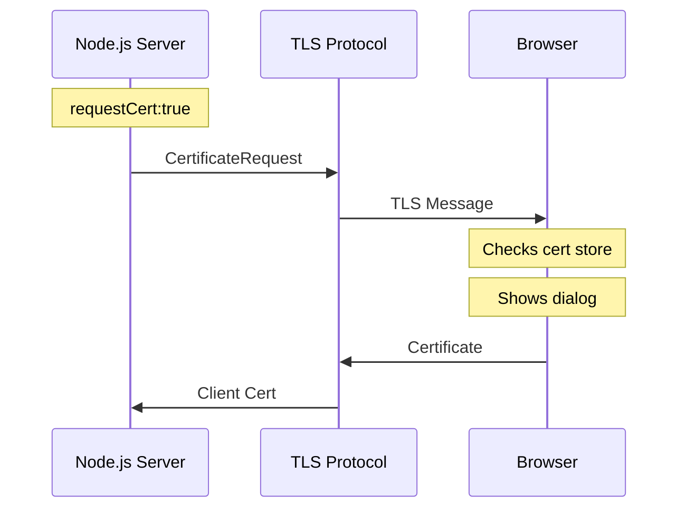
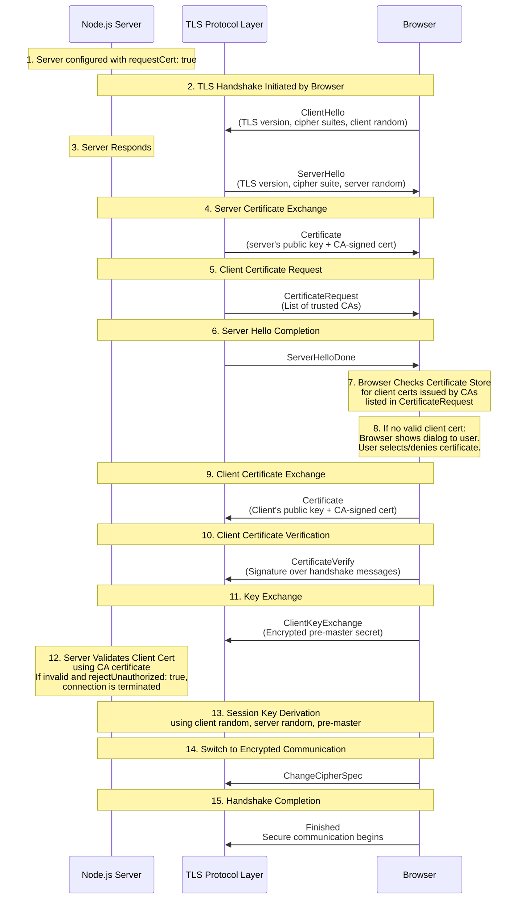
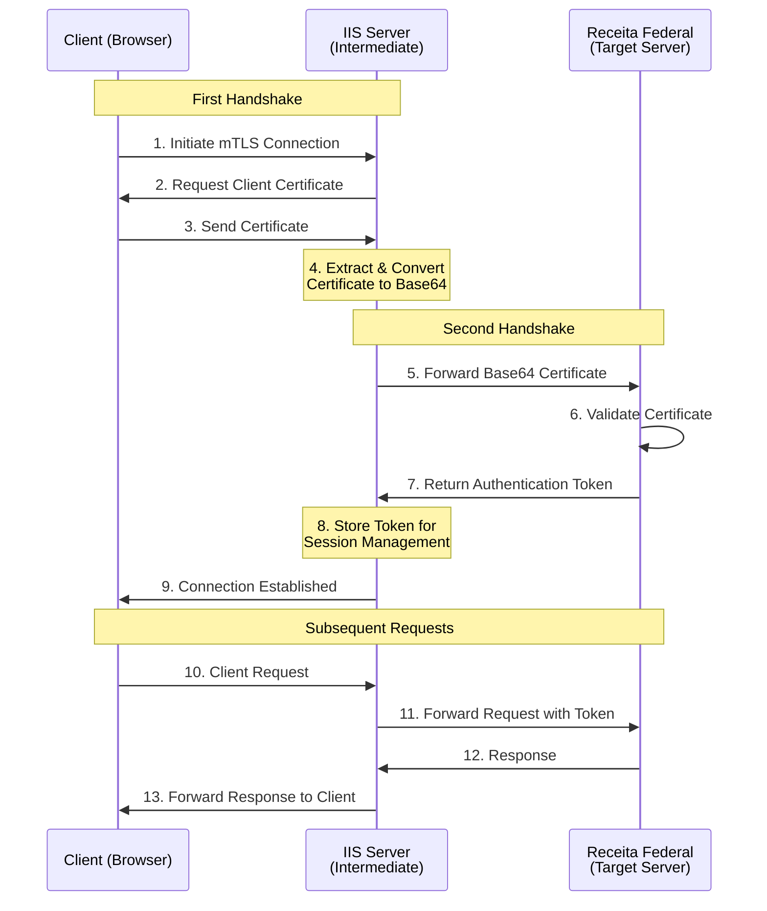

# Digital Certificate Base64 Converter

This is a simple proof-of-concept (PoC) application that converts a digital certificate into a base64 string and sends it to a server.

## Description

This application demonstrates the process of obtaining a client certificate during an mTLS (mutual TLS) handshake. When a client connects, the server initiates a TLS renegotiation [[4]] to request the client certificate. Once the secure connection is established, the server extracts the certificate, converts it to base64 format, and sends it back to the client. This process allows for secure authentication and identification of clients connecting to the server.

## Requirements

- Node.js (version 23.6.0 or higher)
- npm (version 11.0.0 or higher)

## Installation

1. Clone the repository: `git clone https://github.com/carloshnp/digital-certificate-base64-poc.git`
2. Navigate to the project directory: `cd digital-certificate-base64-poc`
3. Install dependencies: `npm install`
4. Install both client and server: `npm run install:all`

## Usage

1. Generate certificates in server directory: `cd server && python3 generate_certificate.py` 
2. Run concurrent dev server and client: `npm run dev`
3. Open the client in Chrome: `http://localhost:5173`

## Introduction

The mutual TLS (mTLS) handshake in our implementation involves a complex bidirectional authentication between the server and browser. Unlike standard TLS where only the server is authenticated, mTLS requires both parties to present and validate certificates. Using Node.js's `TLSSocket` [[5]], the process involves:

### TLS Handshake Flow



1. **Server-side (Node.js/OpenSSL)**:
- Uses OpenSSL for TLS implementation
- Sends certificate request during handshake
- Validates received certificates

2. **Browser-side (Chrome/BoringSSL)**:
- Uses BoringSSL (Chrome's OpenSSL fork)
- Interfaces with OS certificate stores
- Handles UI for certificate selection

3. **Operating System**:
- Manages certificate stores
- Provides native UI for certificate selection
- Handles certificate validation

The entire process is handled at the TLS protocol level, implemented through:
- Server: OpenSSL (via Node.js)
- Browser: BoringSSL (Chrome)
- OS: Native certificate management APIs

## SSL/TLS and SNI Protocols [[1]] [[2]]

### SSL and TLS Overview
SSL (Secure Sockets Layer) and TLS (Transport Layer Security) are cryptographic protocols designed to provide secure communication over computer networks. While SSL was the original protocol developed by Netscape in 1995, TLS is its successor, developed by the IETF in 1999. Today, all SSL versions have been deprecated due to security vulnerabilities, and TLS is the current standard for secure communications.

In our implementation (see `server/src/server.ts`), we use TLS 1.2 as specified in the server options:
```typescript
const options: https.ServerOptions = {
    maxVersion: 'TLSv1.2',
    // ... other options
};
```

### Server Name Indication (SNI)
SNI is a TLS extension that enables a server to safely host multiple TLS certificates for different domains under a single IP address. Here's how it works:

1. During the initial TLS handshake, the client includes the hostname it's trying to reach
2. This allows the server to select and present the correct certificate for that specific domain
3. SNI solves the problem of hosting multiple HTTPS websites on a single IP address

In our implementation, SNI is particularly important when:
- Multiple certificates need to be managed
- The server needs to handle connections from different domains
- Client authentication is required, as demonstrated in our certificate endpoint

The Node.js TLS module (used in our server) has built-in support for SNI, allowing us to efficiently handle secure connections and certificate management.

### TLS Version and Renegotiation Support [[4]]

While TLS 1.3 is the latest version of the protocol offering improved security and performance, our implementation specifically uses TLS 1.2 due to a critical feature requirement: the `renegotiate()` method. TLS 1.3 removed support for renegotiation, which is essential for our client certificate authentication flow. This method allows us to request the client certificate after the initial TLS handshake, providing a more flexible authentication mechanism. In TLS 1.3 environments, achieving similar functionality would require implementing a reverse proxy setup or using alternative authentication methods.

## Browser Certificate Handling [[3]]

When the server sends a certificate request during the TLS handshake, the process involves multiple layers of the browser's architecture. At the network level, the browser (Chrome in our case) processes the TLS handshake message through its network stack implemented in C++, where BoringSSL (Chrome's fork of OpenSSL) handles the cryptographic operations and protocol details. This includes processing the CertificateRequest message that contains the list of acceptable certificate types, CA names, and signature algorithms the server will accept.

The browser then interfaces with the operating system's certificate store through platform-specific APIs. On Windows, Chrome uses the CryptoAPI, specifically functions like `CertOpenSystemStore` and `CertFindCertificatesInStore` to access the Windows Certificate Store, where personal certificates are typically stored in the "MY" store. For other operating systems, similar native APIs are used - macOS utilizes the Keychain Access system, while Linux systems typically use NSS (Network Security Services) or the system's certificate store.

During this process, the browser filters the available certificates based on the server's requirements specified in the CertificateRequest message. It matches the certificates' attributes (such as issuer and key usage) against the server's acceptable CA list and signature algorithms. Only certificates that meet all criteria are presented to the user in the selection dialog. This ensures that only valid certificates that can potentially establish a successful mTLS connection are offered as options to the user.

## Detailed TLS Handshake Flow



1. **Node.js Server Configuration**
    - `requestCert`: true tells the server to request a client certificate during the handshake.
    - `rejectUnauthorized`: true forces the server to reject clients without a valid certificate.

2. **ClientHello**
    - The browser initiates the TLS handshake by sending a `ClientHello` message with supported TLS versions, cipher suites, and a random value (client random).

3. **ServerHello**
    - The server responds with a `ServerHello` message, selecting the TLS version, cipher suite, and sending a server random.

4. **Server Certificate**
    - The server sends its certificate (public key + CA signature) to the browser. The browser validates this certificate against its trusted CA store.

5. **CertificateRequest**
    - Because `requestCert: true`, the server sends a `CertificateRequest` message, listing CAs it trusts for client certificates.

6. **ServerHelloDone**
    - The server signals it’s done with its part of the handshake.

7. **Browser Certificate Handling** [[3]]
    - The browser checks its certificate store (e.g., OS keychain, browser-managed certs) for a client certificate issued by one of the CAs listed in CertificateRequest.

8. **Empty Certificate Store**
    - If no valid certificate is found, the browser prompts the user to select one (e.g., a .p12 or .pfx file).

9. **Client Certificate**
    - The browser sends the client’s certificate (if approved).

10. **Client Certificate Verification**
    - The browser also sends a `CertificateVerify` message, which is a cryptographic signature proving ownership of the private key associated with the client certificate.

11. **ClientKeyExchange**
    -   The browser sends a `ClientKeyExchange` message containing the pre-master secret, encrypted with the server’s public key (from the server’s certificate).

12. **Server-Side Validation**
    - The server validates the client’s certificate using its configured CA (e.g., `ca: fs.readFileSync('ca-cert.pem')` in Node.js).
    - If validation fails and rejectUnauthorized: true, the connection is terminated.

13. **Session Keys and Secure Channel**
    - Both parties derive symmetric session keys using the client random, server random, and pre-master secret.
    - The ChangeCipherSpec and Finished messages finalize the handshake, and encrypted communication begins.

## Intermediate Layer Concept

The intermediate layer implementation serves as a bridge between the client and the target server (Receita Federal), handling certificate management and session maintenance. This architecture abstracts the complexity of direct certificate handling from the target server, reducing the storage of sensitive certificate data, and maintaining persistent sessions through token-based authentication.

### Implementation Overview

The IIS server acts as an intermediate layer with two distinct handshake processes:

1. **Client-to-IIS Handshake**: 
   - Handles the initial mTLS connection with the client
   - Extracts and converts the client's certificate to base64 format
   - Manages the client session using the token received from the target server

2. **IIS-to-Target Handshake**:
   - Establishes a secure connection with Receita Federal's server
   - Forwards the base64 certificate for validation
   - Receives and stores the authentication token for subsequent requests

This approach allows the intermediate server to act as an abstraction layer, maintaining the session state with both the client and the target server while minimizing certificate storage and handling requirements.

### Authentication Flow



### Key Benefits

1. **Security Enhancement**:
   - Certificates are only transmitted during initial authentication
   - Subsequent communications use tokens instead of certificates
   - Reduced exposure of sensitive certificate data

2. **Efficient Session Management**:
   - Token-based authentication for maintaining sessions
   - No need to store or manage certificates after initial handshake
   - Reduced load on the target server

3. **Abstraction Layer**:
   - IIS server handles all certificate-related complexity
   - Simplified interface for client applications
   - Centralized point for security policy enforcement

## References

- https://goteleport.com/blog/turbo-charge-tls-with-alpn-sni/
- https://nodejs.org/api/tls.html#alpn-and-sni
- https://nodejs.org/api/tls.html#tlssocketgetpeercertificatedetailed
- https://nodejs.org/api/tls.html#tlssocketrenegotiateoptions-callback
- https://nodejs.org/api/tls.html#class-tlstlssocket

[1]: https://goteleport.com/blog/turbo-charge-tls-with-alpn-sni/
[2]: https://nodejs.org/api/tls.html#alpn-and-sni
[3]: https://nodejs.org/api/tls.html#tlssocketgetpeercertificatedetailed
[4]: https://nodejs.org/api/tls.html#tlssocketrenegotiateoptions-callback
[5]: https://nodejs.org/api/tls.html#class-tlstlssocket