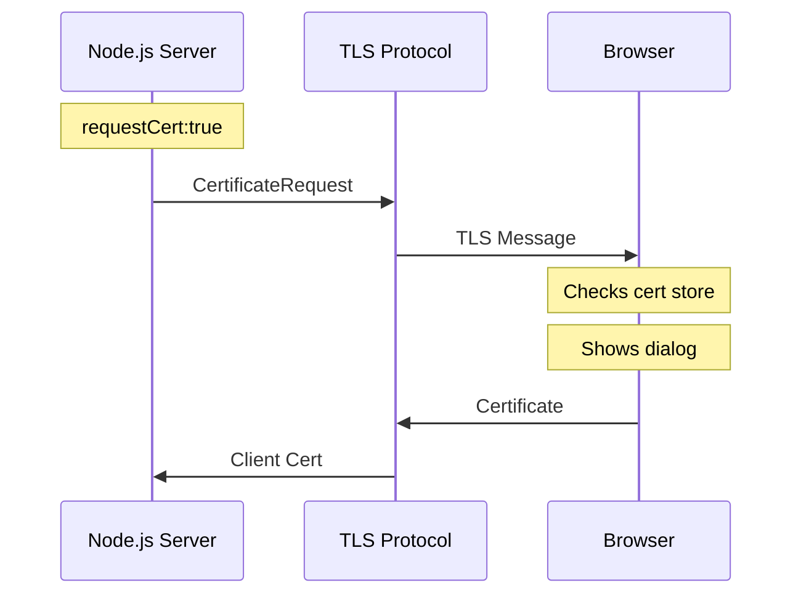

# Digital Certificate Base64 Converter

This is a simple proof-of-concept (PoC) application that converts a digital certificate into a base64 string and sends it to a server.

## Description

This application demonstrates the process of obtaining a client certificate during an mTLS (mutual TLS) handshake. When a client connects, the server initiates a TLS renegotiation to request the client certificate. Once the secure connection is established, the server extracts the certificate, converts it to base64 format, and sends it back to the client. This process allows for secure authentication and identification of clients connecting to the server.

## Requirements

- Node.js (version 23.6.0 or higher)
- npm (version 11.0.0 or higher)

## Installation

1. Clone the repository: `git clone https://github.com/yourusername/digital-certificate-base64-poc.git`
2. Navigate to the project directory: `cd digital-certificate-base64-poc`
3. Install dependencies: `npm install`

## Introduction

The mutual TLS (mTLS) handshake in our implementation involves a complex bidirectional authentication between the server and browser. Unlike standard TLS where only the server is authenticated, mTLS requires both parties to present and validate certificates. Using Node.js's `TLSSocket` [[5]], the process involves:

### TLS Handshake Flow



1. **Server-side (Node.js/OpenSSL)**:
- Uses OpenSSL for TLS implementation
- Sends certificate request during handshake
- Validates received certificates

2. **Browser-side (Chrome/BoringSSL)**:
- Uses BoringSSL (Chrome's OpenSSL fork)
- Interfaces with OS certificate stores
- Handles UI for certificate selection

3. **Operating System**:
- Manages certificate stores
- Provides native UI for certificate selection
- Handles certificate validation

The entire process is handled at the TLS protocol level, implemented through:
- Server: OpenSSL (via Node.js)
- Browser: BoringSSL (Chrome)
- OS: Native certificate management APIs

## SSL/TLS and SNI Protocols

### SSL and TLS Overview
SSL (Secure Sockets Layer) and TLS (Transport Layer Security) are cryptographic protocols designed to provide secure communication over computer networks. While SSL was the original protocol developed by Netscape in 1995, TLS is its successor, developed by the IETF in 1999. Today, all SSL versions have been deprecated due to security vulnerabilities, and TLS is the current standard for secure communications.

In our implementation (see `server/src/server.ts`), we use TLS 1.2 as specified in the server options:
```typescript
const options: https.ServerOptions = {
    maxVersion: 'TLSv1.2',
    // ... other options
};
```

### Server Name Indication (SNI)
SNI is a TLS extension that enables a server to safely host multiple TLS certificates for different domains under a single IP address. Here's how it works:

1. During the initial TLS handshake, the client includes the hostname it's trying to reach
2. This allows the server to select and present the correct certificate for that specific domain
3. SNI solves the problem of hosting multiple HTTPS websites on a single IP address

In our implementation, SNI is particularly important when:
- Multiple certificates need to be managed
- The server needs to handle connections from different domains
- Client authentication is required, as demonstrated in our certificate endpoint

The Node.js TLS module (used in our server) has built-in support for SNI, allowing us to efficiently handle secure connections and certificate management.

### TLS Version and Renegotiation Support
While TLS 1.3 is the latest version of the protocol offering improved security and performance, our implementation specifically uses TLS 1.2 due to a critical feature requirement: the `renegotiate()` method. TLS 1.3 removed support for renegotiation, which is essential for our client certificate authentication flow. This method allows us to request the client certificate after the initial TLS handshake, providing a more flexible authentication mechanism. In TLS 1.3 environments, achieving similar functionality would require implementing a reverse proxy setup or using alternative authentication methods.


## References

[1]: https://goteleport.com/blog/turbo-charge-tls-with-alpn-sni/
[2]: https://nodejs.org/api/tls.html#alpn-and-sni
[3]: https://nodejs.org/api/tls.html#tlssocketgetpeercertificatedetailed
[4]: https://nodejs.org/api/tls.html#tlssocketrenegotiateoptions-callback
[5]: https://nodejs.org/api/tls.html#class-tlstlssocket